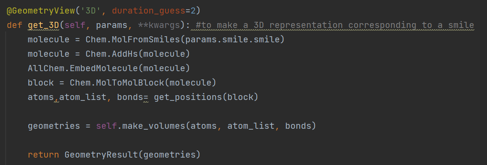
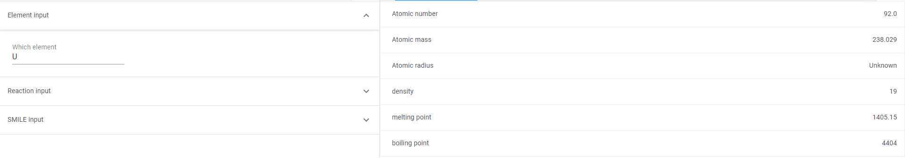
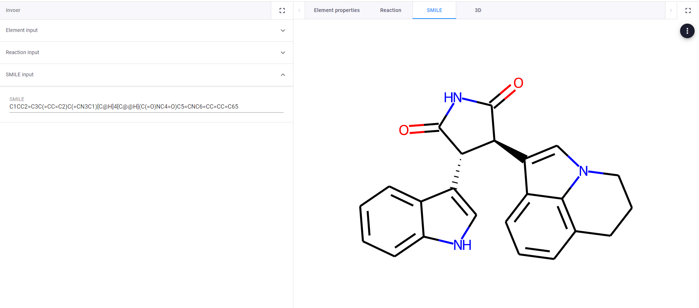
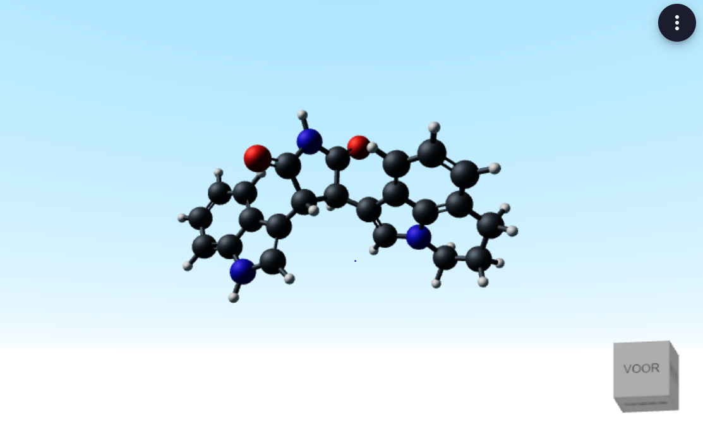

# Chemistry App
This sample app shows off some basic chemical operations that are possible in VIKTOR 

The app contains an input field for chemical elements, which it can then give the properties of.
It contains another input table for reactants and products, which it will use to balance a reaction involving them.
Lastly it has a field for SMILEs(string to represent a chemical), which it turns into 2D or 3D representations.

## Using the functionality
There are two ways in which you can use the functionality: 

With VIKTOR, out-of-the-box, using our [free version](https://www.viktor.ai/try-for-free).

Without VIKTOR, in that case you integrate with your own Python code.

This is a snippet of the functionality’s code from app/Chemistry/controller.py 

With this function a smile is made into an RDkit molecule and 
RDkit finds the most likely position of the atoms, the function handles the 
reading of positions and bonds, and VIKTOR can make a 3D object out of these.

**Apply for a [demo account](https://www.viktor.ai/demo-environment) to get access to this and all other VIKTOR sample applications.** 

## chemistry in VIKTOR
Firstly the app displays how simple operations can easily be made in VIKTOR
to complement more complex operations. 

This displays the properties of elements from the RDkit library.
With a little imagination this shows how VIKTOR could display needed information
from databases or internal data sheets.

Secondly the app can balance chemical reactions based on user inputs.

The functionality doesn't do something extremely complex, but it could
be seen as representative for how operations that are complex for non-programmers
in python can be reduced in complexity through interfaces. Additionaly
it is only a small representation of the much more complex calculations that
could be made accessible to the non-programmers in chemistry.

Lastly, the app can visualize SMILES.

Having visualization alongside the functionalities that
resident programmers can build can save a lot
of clicking back and forth.

VIKTOR even has 3D visualization, meaning custom molecule representation
can be made in the same place where programs are run, which makes tailored to fit
applications even more capable of doing everything desirable for chemical engineers.

